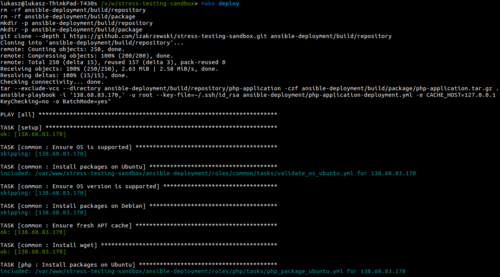

# Stress testing sandbox
[](https://travis-ci.org/lzakrzewski/stress-testing-sandbox)

## Know-how
This repository is a simple sandbox which can be used to quickly compare multiple infrastructure setups.


#### Features:
With **stress-testing-sandbox** you can:
 - `provision` your host (hosts) to install all required dependencies with [Ansible](http://docs.ansible.com/ansible/intro_getting_started.html)
 - `deploy` [php-application](doc/php-application.md) to your host with [Ansible](http://docs.ansible.com/ansible/intro_getting_started.html)
 - execute `stress-test` to check (with [Gatling](http://gatling.io/)) how high is the load that your infrastructure can handle
 
[Php-application](doc/php-application.md) is just simple wall with posts. It's written with `PHP-7` and it uses `redis-cache` as storage.
[Php-application](doc/php-application.md) with a `redis-cache` can work on a single instance or on separate instances (it depends on [configuration](doc/advanced-configuration.md)).

#### Read more:
- [Php application reference](doc/php-application.md)
- [Results of stress testing](doc/results.md)

You can fork this and adjust to your project or just have some fun with `provisioning`, `deployment`, and `stress-testing`.

## Local machine requirements
- [Make](https://www.gnu.org/software/make/manual/make.html)
- [Docker](https://docs.docker.com/engine/installation/) 1.9 or higher
- [Ansible](http://docs.ansible.com/ansible/intro_getting_started.html)
- SSH key (id_rsa[.pub])
- Fast internet connection

## Host requirements
- SSH access
- Ubuntu 14.04, 16.04 or debian `jessie`
- Python installed (because of `Ansible`)

## Installation & configuration
1. Clone repository:  
`git clone git@github.com:lzakrzewski/stress-testing-sandbox.git`
2. Go to project directory:  
`cd stress-testing-sandbox`
3. Create configuration file with **make** syntax:

```make
PHP_APPLICATION_HOST         = 111.111.111.111 #address of host with php application deployed
PHP_APPLICATION_HOST_USER    = root #user to log in with ssh
PHP_APPLICATION_HOST_SSH_KEY = ~/.ssh/id_rsa #path to private ssh key
PHP_APPLICATION_CACHE_HOST   = 125.125.0.1 #redis-cache address in private network

REDIS_CACHE_HOST         = 222.222.222.222 #address of host with redis cache
REDIS_CACHE_HOST_USER    = root #user to log in with ssh
REDIS_CACHE_HOST_SSH_KEY = ~/.ssh/id_rsa #path to private ssh key
```

and save it here: `config/config.makefile`

In the case when an application should be deployed to only one host then the configuration for `PHP_APPLICATION_HOST` and `REDIS_CACHE_HOST` can be the same.      
**See more:** [advanced configuration](doc/advanced-configuration.md)

## Deployment and Provisioning
**Deployment** and **provisioning** were created with [ansible-playbook](http://docs.ansible.com/ansible/playbooks.html) command.
The script at first installs all required dependencies on your host(s) (`provisioning`) and then it `deploys` a `php-application`.

Here is a **make** target which runs [ansible-playbook](http://docs.ansible.com/ansible/playbooks.html) using the configuration from **config/config.makefile**:  
`make deploy`

## Stress testing
**Stress testing** was created with [Gatling](http://gatling.io/).   
The script runs stress tests using the configuration from **config/config.makefile**.  
`make run_stress_test`

Stress test scenario:
- Render wall with posts
- Publish a post on the wall

By default, it ramps from 1 request per second to 100 during 100 seconds. Those values can be set, see [configuration](doc/advanced-configuration.md).
Executing of stress test requires a fast internet connection.    
**Notice** It's a great idea to run `make run_stress_test` from the machine on the same network as the `php-application` and `redis-cache` host.

**See more:** [Gatling simulation scenario](gatling-stress-testing/user-files/simulations/PublishPostSimulation.scala).

#### Stress testing result:


**See more:** [results](doc/results.md).

## Examples

#### Application provisioning & deployment:



#### Working application:


